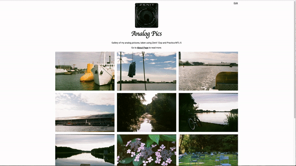

# Analog Pics

## About

This goal of this project was to explore recent technologies and build a version of the simple picture gallery which can be managed by custom build CMS. 

It could be divided into three separate modules: frontend part, CMS part, and cloud functions. 

* Frontend Part - the simplest possible gallery/image viewer. With some basic functionality. Made to be as small as possible and performant.

* CMS Part - the advanced user interface to upload, remove and publish pictures. Lazy loaded with all the added packages like firebase and angular material components. 

* Cloud Functions - these handle the creation of thumbnails and putting information into the database. Additionally, there is a function which would serve the list of images to Frontend Part, so I do not have to use Firebase package to retrieve the images. 

## How to run the Project

There is no easy way to run the CMS part without a login, of course, it should be easy to make it this project work on somebody’s else account. 

### Deploying to other Firebase account
Assuming you know how firebase works, you only need to create a new project, pass to right firebase config `src/environments`, deploy this project using firebase CLI (so all the rules get uploaded and functions). Finally, create a user account via Firebase console. 
